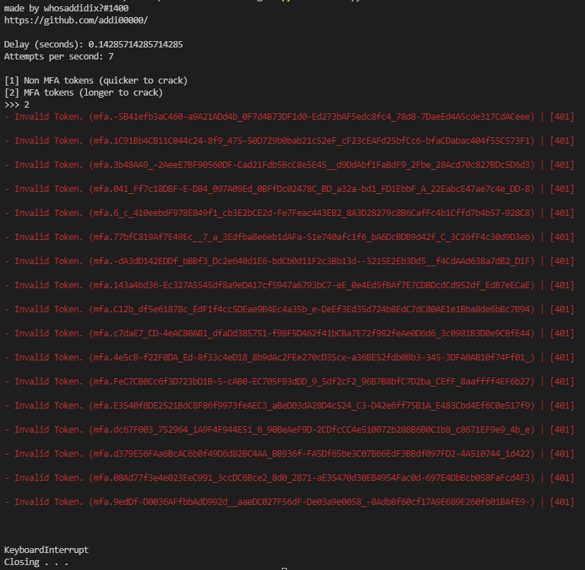

# Discord Token Generator
#### A POC program written in python to generate "valid" tokens and test them

## Disclaimer ⚠
#### **USE AT YOUR OWN RISK:**  Running too fast can lead to being rate limited (IP banned) from discord entirly for over 24 hours. Read: https://discord.com/developers/docs/topics/rate-limits

## Usage
1. clone the repo with ```git clone https://github.com/addi00000/discord-token-gen.git```
2. install required modules with ```python -m pip install -r requirements.txt```
3. execute the script with ```python main.py```

## UI




